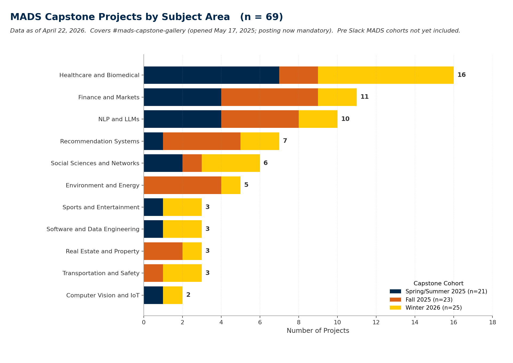

# MADS Capstone Projects by Subject Area



A minimal public dataset of University of Michigan Master of Applied Data Science capstone projects, labeled by subject area. Built by a current MADS student because the Slack gallery is great for browsing and terrible for answering basic questions like "how many of these are healthcare" or "has anyone done a real estate capstone before."

## What is a MADS capstone

Every term, teams of one to four MADS students complete SIADS 699, the capstone course. Each team builds an end to end data science project in a domain of their choosing, presents it, and some share it in the program's `#mads-capstone-gallery` Slack channel. Three terms run each year (Spring/Summer, Fall, Winter), so the sample grows.

MADS is the online Master of Applied Data Science out of the University of Michigan School of Information. Program details live at [si.umich.edu/programs/master-applied-data-science](https://www.si.umich.edu/programs/master-applied-data-science).

This repo is not affiliated with UMSI. It's one student aggregating what other students have posted publicly. For anything official, go to UMSI directly.

## What's in the CSV

File: [`data/mads_capstone_projects_by_subject_area.csv`](data/mads_capstone_projects_by_subject_area.csv)

Each row is one project. Fields:

| Field | Example |
| --- | --- |
| `cohort` | `SS25`, `F25`, `W26` |
| `team_number` | `14` |
| `project_title` | `The Flavor Saviors: Ingredient and Cuisine Network Representations` |
| `team_size` | `3` |
| `subject_category` | `NLP and LLMs` |
| `has_report` / `has_video` / `has_code_repo` / `has_live_app` | boolean |
| `notes` | populated only for judgment calls or caveats |

Category definitions and judgment calls live in [`taxonomy.md`](taxonomy.md).

## Privacy

This dataset is deliberately minimal. What it does not contain, by design:

- Student names or Slack handles
- Mentor names
- Email addresses
- Any URL to a student deliverable (report, video, repo, deployed app)
- Anything that could identify a specific individual

What it does contain: the project title, the cohort, the team size count, and my subject area tag. Project titles are the public face of each capstone. Students share them in a gallery channel explicitly so others can see them. UMSI itself publicizes capstone titles and team names in Project Exposition coverage and award announcements on its own website. This dataset is strictly more conservative than what UMSI's own public pages show.

**Redaction or correction.** If you are a team member, mentor, UMSI faculty, or staff, and you want something removed, corrected, or never added in the first place, [open an issue](https://github.com/quietnotion/mads-capstone-dataset/issues/new/choose). You do not need to explain why.

**On making individual projects more visible.** Capstones are team efforts. Publishing richer information about a specific project would need sign off from every member of that team, and that coordination is unlikely to happen in practice. This dataset will stay aggregate only. Teams who want their work promoted should use UMSI's own channels.

## Contributing

You are welcome to suggest:

- A new cohort's worth of data, once it wraps and projects are shared
- Corrections to a team number, title, team size, or a boolean flag
- Reclassification of a project into a different subject category
- A new subject category with supporting rationale
- Improvements to the taxonomy

**Easiest path.** On GitHub, navigate to the CSV file and click the pencil icon ("Edit this file"). Make your change directly in the browser. GitHub will create a pull request automatically. No local git setup needed.

**No GitHub account?** Open an issue using the [web form](https://github.com/quietnotion/mads-capstone-dataset/issues/new/choose) (GitHub sign up is free and takes under a minute).

See [`CONTRIBUTING.md`](CONTRIBUTING.md) for details.

## Reproducing the chart

```
pip install matplotlib numpy
python scripts/make_chart.py
```

Output: `chart.png`.

## License

Everything in this repo is released under [CC0 1.0 Universal](LICENSE) (public domain). Use it however you want. No attribution required, though a link back is appreciated.

## Acknowledgments

Data is self-reported by MADS teams who posted in `#mads-capstone-gallery` since the channel opened on May 17, 2025. Category tags are this author's judgment. This project is not endorsed or reviewed by the University of Michigan or the School of Information.
